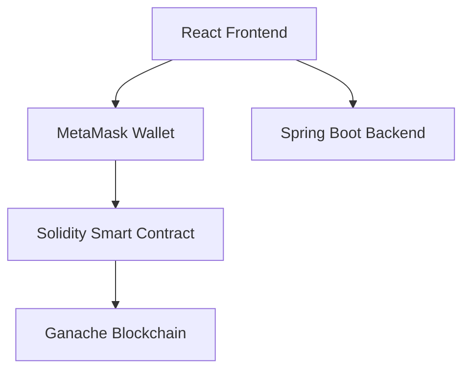

# 🚀 Early Supporter Reward DApp

A decentralized application (DApp) that rewards users who discover and support content before it becomes popular.

Traditional social media platforms reward creators and algorithms but provide no incentive for early supporters. This project introduces a blockchain-based solution where users can financially support content at an early stage and receive rewards if the content later becomes viral.

---

## 📖 Problem Statement

On most content platforms:

- Early supporters receive no recognition.
- Popularity benefits creators and platforms only.
- Users are encouraged to follow trends rather than discover quality content early.

This DApp solves the issue by rewarding the first supporters of content through a transparent smart contract.

---

## 💡 Solution Overview

Creators register content on the blockchain.

Supporters can:

- Support content by sending a fixed amount of ETH.
- Become one of the first 20 supporters.
- Receive rewards when the creator marks the content as viral.

The entire process is handled transparently through Ethereum smart contracts.

---

## 🏗️ System Architecture



---

## ✨ Features

### Creator Features

- Register content on-chain
- Store title and description hash
- View supporter count
- View ETH pool size
- Mark content as viral
- Trigger reward distribution

### Supporter Features

- Connect wallet using MetaMask
- Support content with fixed ETH amount
- View supporter position
- Receive rewards automatically

### Smart Contract Features

- Fixed support amount
- Maximum 20 supporters
- First-come-first-served order
- Duplicate support prevention
- Automatic reward distribution
- Creator-only viral trigger

---

## 🔒 Smart Contract Rules

| Rule | Description |
|--------|------------|
| Support Amount | Fixed ETH amount |
| Maximum Supporters | 20 |
| Duplicate Support | Not Allowed |
| Viral Trigger | Creator Only |
| Reward Distribution | Automatic |
| Support Order | Preserved On-Chain |

---

## 🔄 Workflow

### 1. Content Registration

```text
Creator
   │
   ▼
Register Content
   │
   ▼
Stored On Blockchain
```

### 2. Early Support

```text
Supporter
   │
   ▼
Send ETH
   │
   ▼
Contract Records Wallet
   │
   ▼
Added To Supporter Queue
```

### 3. Viral Trigger

```text
Creator
   │
   ▼
Mark Viral
   │
   ▼
Smart Contract Executes
   │
   ▼
Rewards Distributed
```

---

## ⚠️ Edge Cases Handled

### Duplicate Support Prevention

```solidity
require(
    !hasSupported[msg.sender],
    "Already supported"
);
```

### Support Limit Enforcement

```solidity
require(
    supporters.length < 20,
    "Support limit reached"
);
```

### Unauthorized Viral Trigger

```solidity
require(
    msg.sender == creator,
    "Only creator allowed"
);
```

---

## 🛠️ Technology Stack

### Blockchain
- Solidity
- Truffle
- Ganache
- MetaMask

### Frontend
- React.js
- Vite
- Ethers.js
- Tailwind CSS

### Backend
- Spring Boot
- Spring Data JPA
- JWT Authentication
- H2 Database

---

## 📂 Project Structure

```text
Early-Supporter-DApp/
│
├── contracts/
│   └── EarlySupport.sol
│
├── migrations/
│
├── frontend/
│   ├── src/
│   └── package.json
│
├── backend/
│   ├── src/
│   └── pom.xml
│
├── truffle-config.js
│
└── README.md
```

---

## ⚙️ Installation

### Clone Repository

```bash
git clone https://github.com/YOUR_USERNAME/early-supporter-dapp.git

cd early-supporter-dapp
```

### Install Frontend Dependencies

```bash
cd frontend
npm install
```

### Install Backend Dependencies

```bash
cd backend
mvn clean install
```

---

## ▶️ Running The Project

### Start Ganache

```bash
ganache-cli --host 127.0.0.1 --port 7545 --deterministic
```

### Deploy Smart Contract

```bash
truffle compile
truffle migrate --network development
```

### Start Backend

```bash
cd backend

mvn spring-boot:run
```

### Start Frontend

```bash
cd frontend

npm run dev
```

Application URL:

```text
http://localhost:5173
```

---

## 🧪 Test Cases

✅ Content Registration

✅ Early Support Success

✅ Duplicate Support Rejection

✅ 21st Supporter Rejection

✅ Creator-only Viral Trigger

✅ ETH Reward Distribution

✅ MetaMask Integration

---


---

⭐ If you found this project interesting, consider giving it a star.
